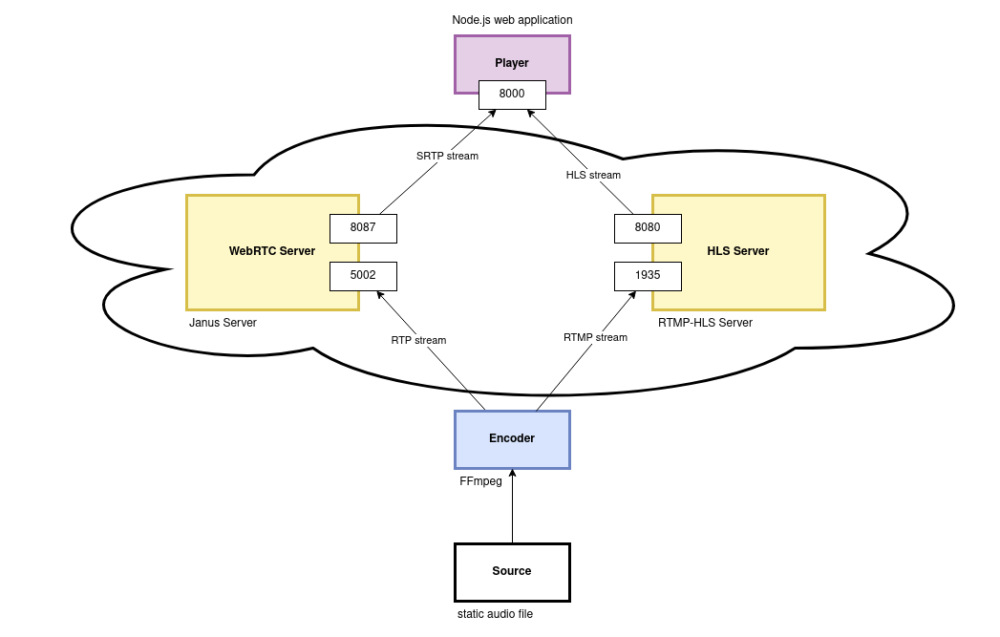

# Radio Playground

Radio Playground is an educational project purposed to provide playground for different audio streaming solutions. It is meant as a learning and testing tool.

Project is built as a docker network where multiple containers play their role in the radio streaming network. At the current stage, HLS and WebRTC playgrounds are provided.

## Projects Leveraged

* [HLS](https://developer.apple.com/streaming/)
* [HLS.js](https://github.com/video-dev/hls.js)
* [Janus server](https://janus.conf.meetecho.com/)
* [Janus.js](https://cdn.jsdelivr.net/npm/janus-gateway@0.2.3/)
* [FFmpeg](https://ffmpeg.org/ffmpeg-all.html)
* [RTMP-HLS Server](https://github.com/TareqAlqutami/rtmp-hls-server])

## Project Structure

**Source** - a static audio file fetched from the internet.

**Player** - receives audio streams. Built as a simple NodeJS application. Currently, provides two radio playing options: 

    * http://localhost:8083/radio/hls - a HLS.js library player that pulls down the HLS manifest, decides which bitrates to play, then requests the fragments and shoves them into the HTML audio player.
    * http://localhost:8083/radio/webrtc - a Janus.js library player that attaches to the Janus Streaming Plugin and mounts to the RTP stream coming into the Janus server's 5002 port. 

**Encoder** - a simple Ubuntu device. The encoder runs FFMPEG which fetches the source audio and transforms it into streams ingested by the streaming servers. Currently, creates an RTMP stream for the HLS server, and a RTP stream for Janus server. 

**Janus Server** - serves audio stream in a WebRTC fashion. Leverages the [janus-gateway](https://github.com/meetecho/janus-gateway). Currently, configured to receive RTP streams into the 5002 port. 

**HLS Server** - serves audio stream as a HLS stream. Leverages the [rtmp-hls streaming server](https://hub.docker.com/r/alqutami/rtmp-hls). Receives RTMP stream into the 1935 port, fragments it into different bitrate segments, creates manifests and serves them to clients.

## Start
### Debian Distros

